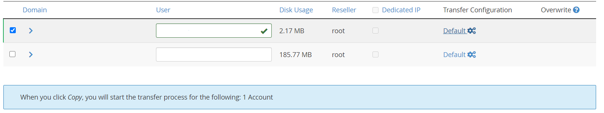
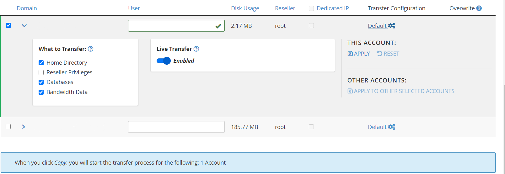

# Performing a cPanel to cPanel Migration

A guide on performing a cPanel to cPanel Migration

```eval_rst
.. note::
   cPanel requires the ability to connect to your other cPanel server via your defined SSH port and port 2087
```

To begin your migration you first need to ensure you are logged into your WHM panel.
The migration can only be started via WHM, which is the server-wide control panel, as opposed to cPanel which is the domain specific panel for your sites.

```eval_rst
.. note::
   cPanel Migrations have to be initiated from the destination cPanel server
```

Once you are logged in to WHM, use the search box in the top left under the WHM logo to search for "Transfer Tool"
Click on "Transfer Tool" to be directed to the Transfer Tool page in which you can start your migration.


Now you are within the Transfer Tool section of WHM, fill in the details accordingly for the server you want to pull your data from.


- Remote Server Address: The IP Address of the other server
- Remote SSH Port: The port SSH is bound to on the other server
- Root Password: The password for the root user on the other server

```eval_rst
.. note::
   UKFast Linux Servers listen on port 2020 for SSH by default
```


Once you have filled in the server details as per the above screenshot, scroll down and select the Remote Server Type
Next, click the "Scan Remote Server" button which will have the migration tool connect to the remote server and scan for migratable accounts


When the scan completes, select the accounts you want to transfer to your server.

```eval_rst
.. note::
   As of cPanel version 90 there has been an option "Live Transfer" which can be automatically enabled during site migration. This must be disabled before transfer is initiated as otherwise this will replace DNS records for your site with ones pointing to the destination server immediately, a highly undesirable outcome which can cause many issues.
```
To view the current status of the Live Transfer option for each site simply click the Default option on the right hand side of this domain



If you see the Live Transfer option 'Enabled' here then click the slider underneath to set this to 'Disabled', if you then select the "Apply To Other Selected Accounts" option on the right hand side this will disable Live Transfer for all other domains that have been selected.



After selecting what you want to transfer over, click the "Copy" button to start the migration


When the migration completes you will see the following page showing that both the transfer of data and restore of the account to your server is complete.


After the migration, you can go to the "List Accounts" page in WHM and you will be able to see the account you have just transferred.


You have successfully performed a cPanel to cPanel Migration!


Before amending your DNS to point to your new server, you can test your websites using a hostfile change
You can view more information on that [here](https://my.ukfast.co.uk/safedns/index.php)

```eval_rst
  .. title:: Performing a cPanel to cPanel Migration
  .. meta::
     :title: Performing a cPanel to cPanel Migration
     :description:  A guide to performing a cPanel to cPanel Migration
     :keywords: ukfast, cpanel, migration, move, website, transfer, whm
